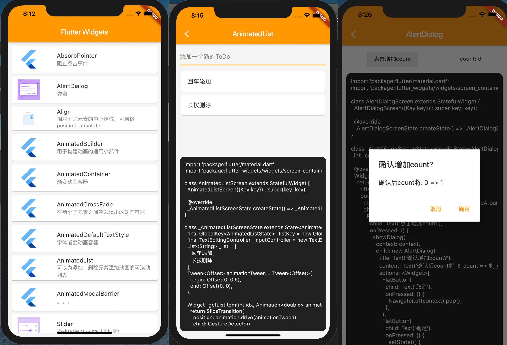

# flutter_widgets

学习Flutter各种Widgets的项目，包含各种样例demo

## 截图

## 进度

- [x] AbsorbPointer
- [x] AlertDialog
- [x] Align
- [x] AnimatedBuilder
- [x] AnimatedContainer
- [x] AnimatedCrossFade
- [x] AnimatedDefaultTextStyle
- [x] AnimatedListState
- [x] AnimatedModalBarrier (不太懂)
- [x] AnimatedOpacity
- [x] AnimatedPhysicalModel
- [x] AnimatedPositioned
- [x] AnimatedSize
- [ ] AnimatedWidget
- [ ] AnimatedWidgetBaseState
- [x] Appbar
- [x] AspectRatio
- [x] AssetBundle
- [x] BackdropFilter
- [x] Baseline
- [x] BottomNavigationBar
- [x] BottomSheet
- [x] ButtonBar
- [x] Card
- [x] Center
- [x] Checkbox
- [x] Chip
- [x] CircularProgressIndicator
- [x] ClipOval
- [x] ClipPath
- [x] ClipRect
- [x] Column
- [x] ConstrainedBox
- [x] Container
- [x] CupertinoActionSheet
- [x] CupertinoActivityIndicator
- [x] CupertinoAlertDialog
- [x] CupertinoButton
- [x] CupertinoDatePicker
- [x] CupertinoDialog
- [x] CupertinoDialogAction
- [x] CupertinoFullscreenDialogTransition
- [ ] CupertinoNavigationBar
- [ ] CupertinoPageScaffold
- [ ] CupertinoPageTransition
- [ ] CupertinoPicker
- [ ] CupertinoPopupSurface
- [ ] CupertinoScrollbar
- [ ] CupertinoSegmentedControl
- [ ] CupertinoSlider
- [ ] CupertinoSwitch
- [ ] CupertinoTabBar
- [ ] CupertinoTabScaffold
- [ ] CupertinoTabView
- [ ] CupertinoTextField
- [ ] CupertinoTimerPicker
- [ ] CustomMultiChildLayout
- [ ] CustomPaint
- [ ] CustomScrollView
- [ ] CustomSingleChildLayout
- [ ] DataTable
- [ ] Date & Time Pickers
- [ ] DecoratedBox
- [ ] DecoratedBoxTransition
- [ ] DefaultTextStyle
- [ ] Dismissible
- [ ] Divider
- [ ] DragTarget
- [ ] Draggable
- [ ] Drawer
- [ ] DropdownButton
- [ ] ExcludeSemantics
- [ ] Expanded
- [ ] ExpansionPanel
- [ ] FadeTransition
- [ ] FittedBox
- [ ] FlatButton
- [ ] FloatingActionButton
- [ ] Flow
- [ ] FlutterLogo
- [ ] Form
- [ ] FormField
- [ ] FractionalTranslation
- [ ] FractionallySizedBox
- [ ] FutureBuilder
- [ ] GestureDetector
- [ ] GridView
- [ ] Hero
- [ ] Icon
- [ ] IconButton
- [ ] IgnorePointer
- [ ] Image
- [ ] IndexedStack
- [ ] IntrinsicHeight
- [ ] IntrinsicWidth
- [ ] LayoutBuilder
- [ ] LimitedBox
- [ ] LinearProgressIndicator
- [ ] ListBody
- [ ] ListTile
- [ ] ListView
- [ ] LongPressDraggable
- [ ] MaterialApp
- [ ] MediaQuery
- [ ] MergeSemantics
- [ ] Navigator
- [ ] NestedScrollView
- [ ] NotificationListener
- [ ] Offstage
- [ ] Opacity
- [ ] OverflowBox
- [ ] Padding
- [ ] PageView
- [ ] Placeholder
- [ ] PopupMenuButton
- [ ] PositionedTransition
- [ ] Radio
- [ ] RaisedButton
- [ ] RawImage
- [ ] RawKeyboardListener
- [ ] RefreshIndicator
- [ ] RichText
- [ ] RotatedBox
- [ ] RotationTransition
- [ ] Row
- [ ] Scaffold
- [ ] ScaleTransition
- [ ] ScrollConfiguration
- [ ] Scrollable
- [ ] Scrollbar
- [ ] Semantics
- [ ] SimpleDialog
- [ ] SingleChildScrollView
- [ ] SizeTransition
- [ ] SizedBox
- [ ] SizedOverflowBox
- [ ] SlideTransition
- [x] Slider
- [ ] SliverAppBar
- [ ] SnackBar
- [ ] Stack
- [ ] Stepper
- [ ] StreamBuilder
- [ ] Switch
- [ ] TabBar
- [ ] TabBarView
- [ ] Table
- [ ] Text
- [ ] TextField
- [ ] Theme
- [ ] Tooltip
- [ ] Transform
- [ ] WidgetsApp
- [ ] Wrap

